# КУРСОВАЯ РАБОТА

## ВЕБ-ПРИЛОЖЕНИЕ, ОТОБРАЖАЮЩЕЕ ТЕПЛОВУЮ КАРТУ ВРЕМЕНИ ВЗГЛЯДА ПОЛЬЗОВАТЕЛЯ НА ОБЛАСТИ ВЕБ-ДОКУМЕНТА, ПОСРЕДСТВОМ ФРЕЙМВОРКА AngularJS

[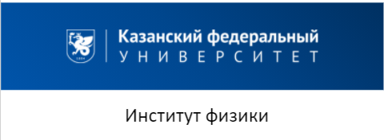](https://kpfu.ru/physics)

## Автор

### :boy: Ямолдин Александр Алексеевич
#### [](https://t.me/AAYamoldin)   [](https://kazan.hh.ru/resume/6b8efacbff077b7cc40039ed1f316d54674934)    [:email:](aayamoldin@gmail.com)

# Краткий обзор проделанной работы
### Свободная библиотека для отслеживания движения глаз была взята [осюда](https://webgazer.cs.brown.edu/)
```
@inproceedings{papoutsaki2016webgazer,
    author = {Alexandra Papoutsaki and Patsorn Sangkloy and James Laskey and Nediyana Daskalova and Jeff Huang and James Hays},
    title = {WebGazer: Scalable Webcam Eye Tracking Using User Interactions},
    booktitle = {Proceedings of the 25th International Joint Conference on Artificial Intelligence (IJCAI)},
    pages = {3839--3845},
    year = {2016},
    organization={AAAI}
    }
```
#### Слайд 1. Основная информация
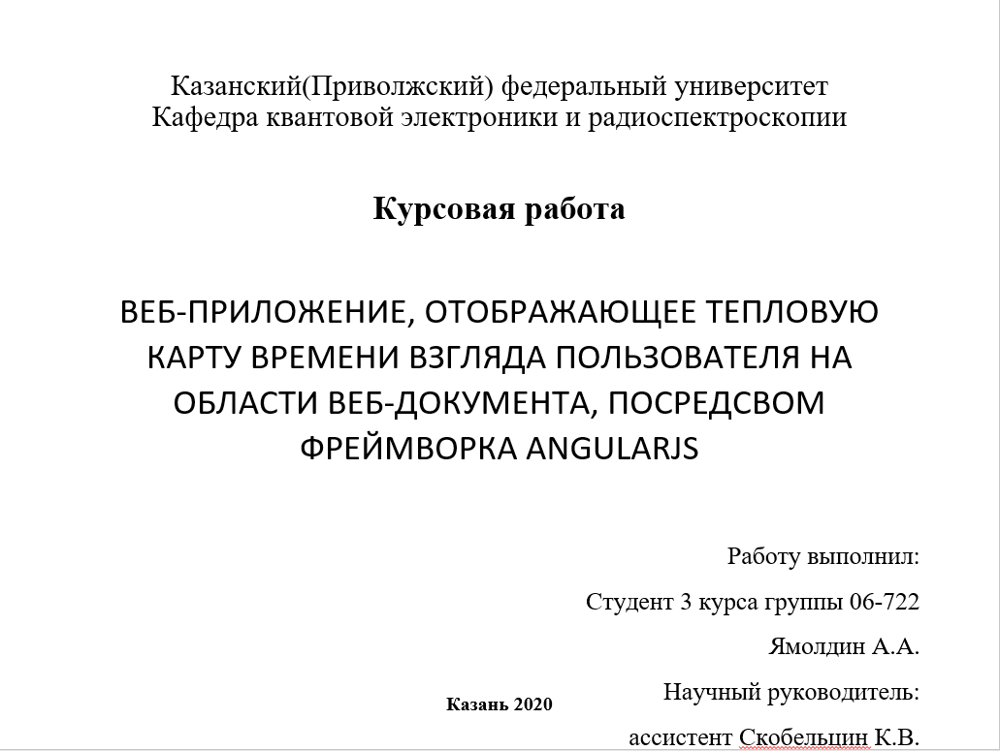
#### Слайд 2. Введение
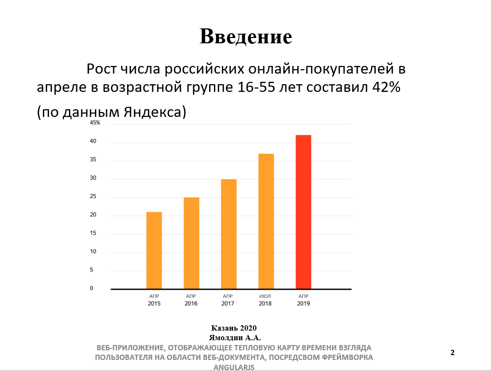
#### Слайд 3. Цель работы
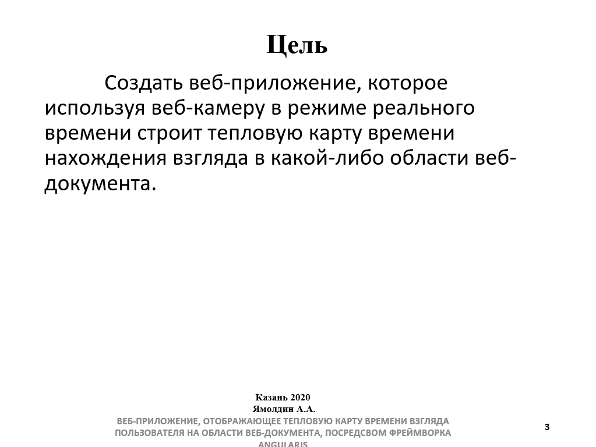
#### Слайд 4. Реализация
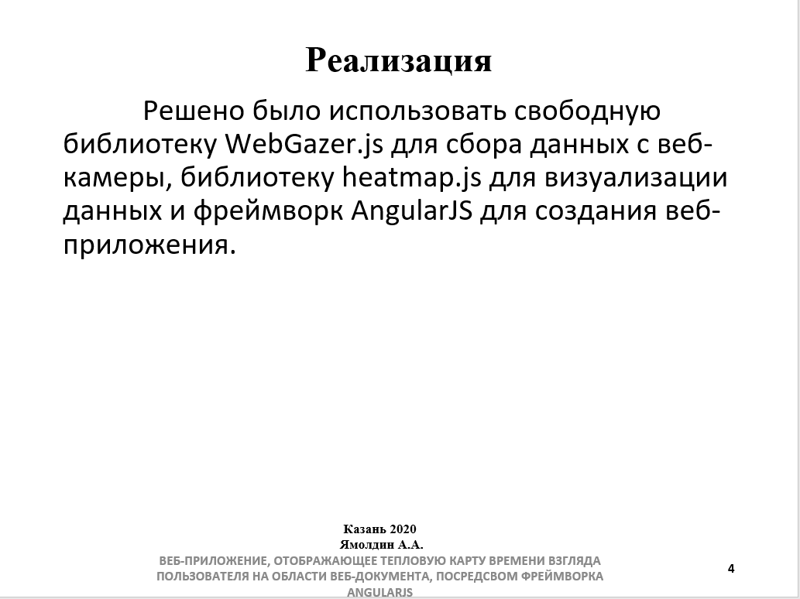
#### Слайд 5. Маршрутизация

#### Слайд 6. Калибровка этап 1
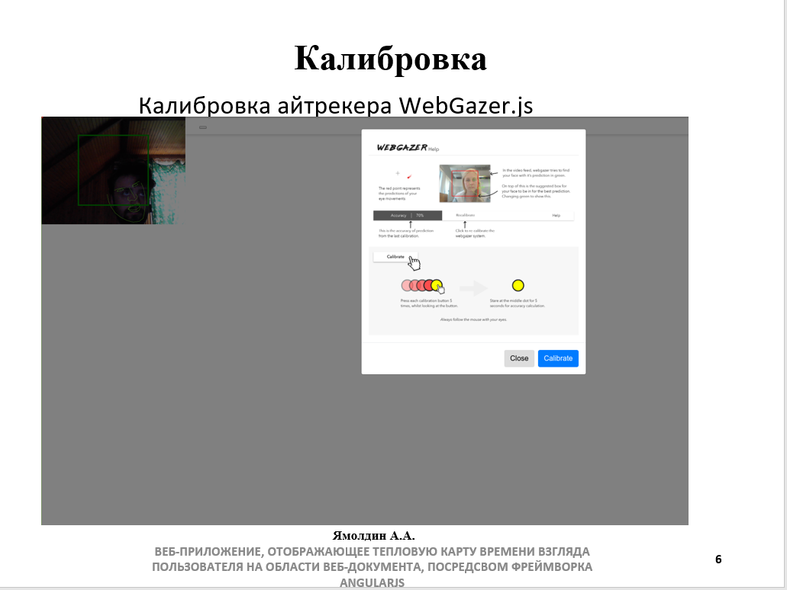
#### Слайд 7. Калибровка этап 2
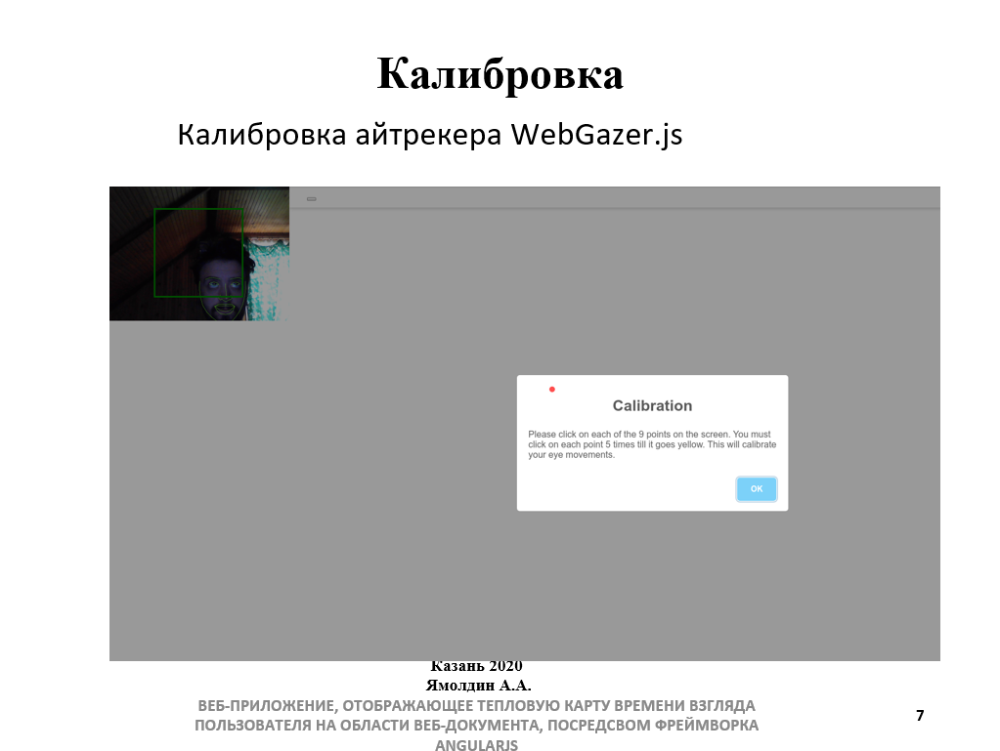
#### Слайд 8. Калибровка этап 3
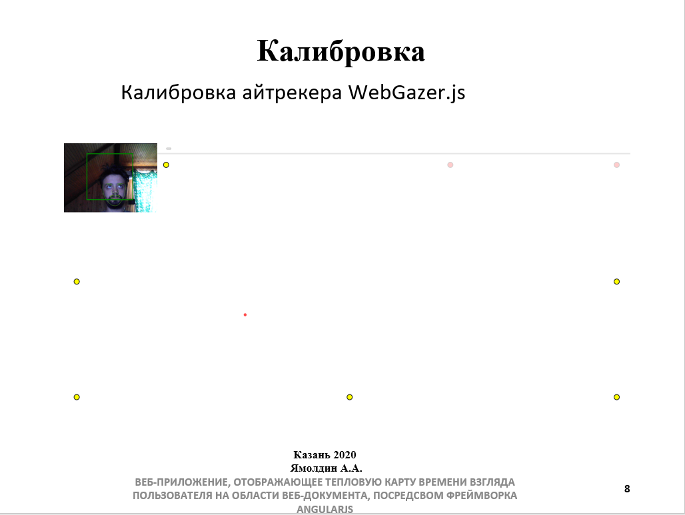
#### Слайд 9. Калибровка этап 4
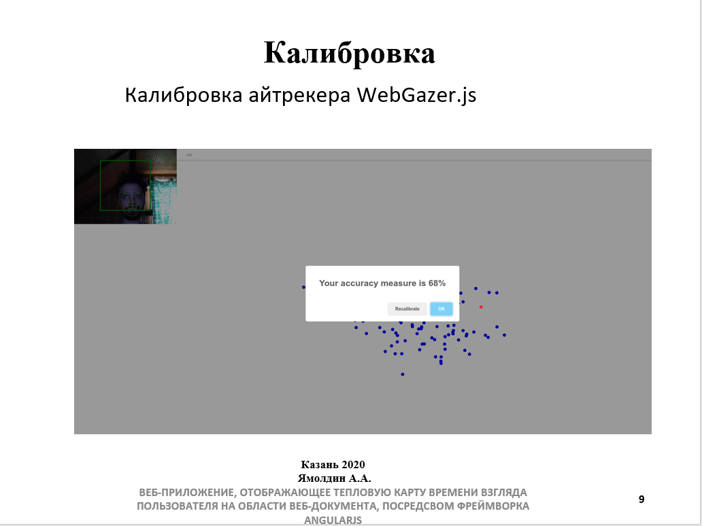
#### Слайд 10. Построение тепловой карты
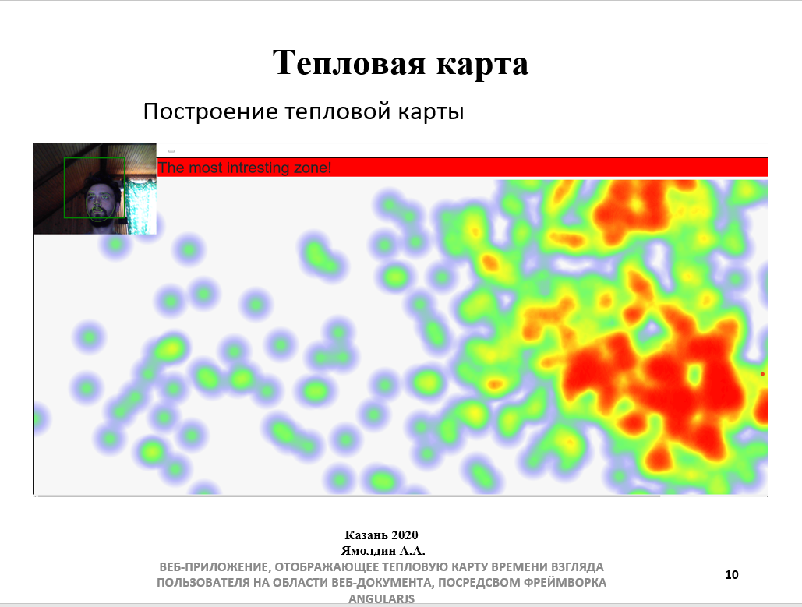
#### Слайд 11. Построение тепловой карты
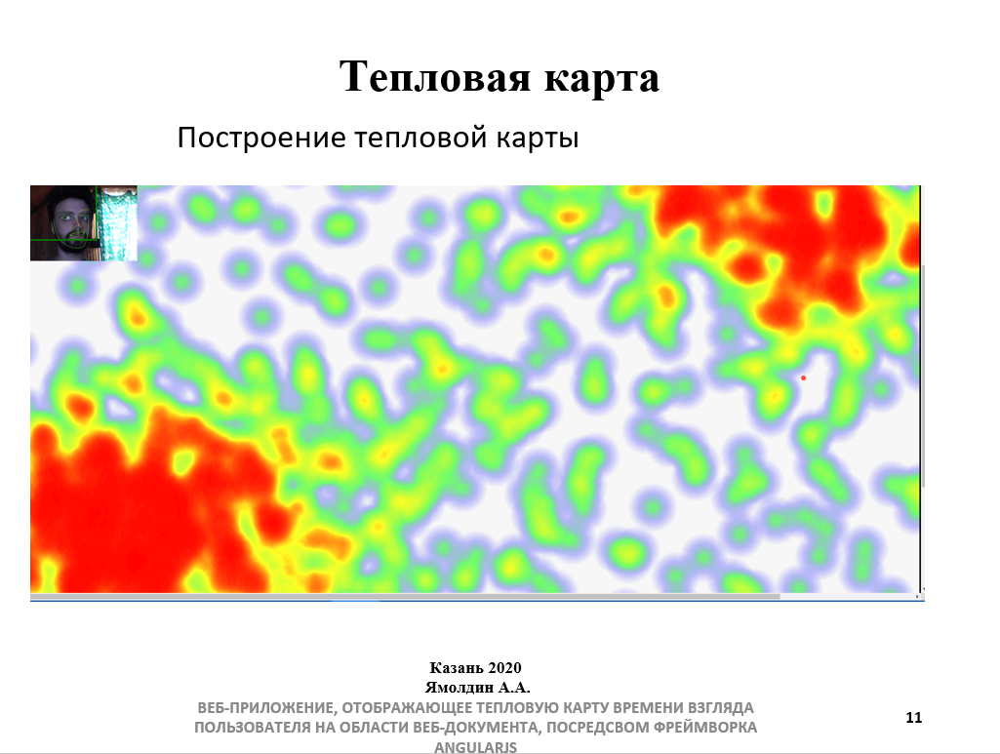
#### Слайд 12. Размещение на хостинге
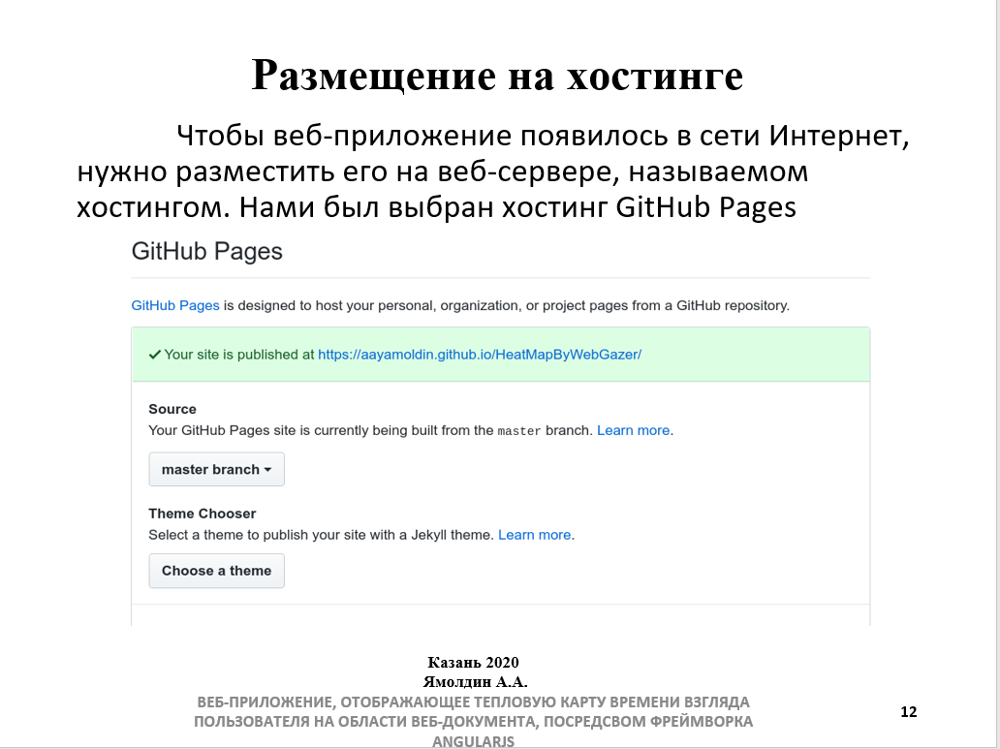
#### Слайд 13. Общий вид
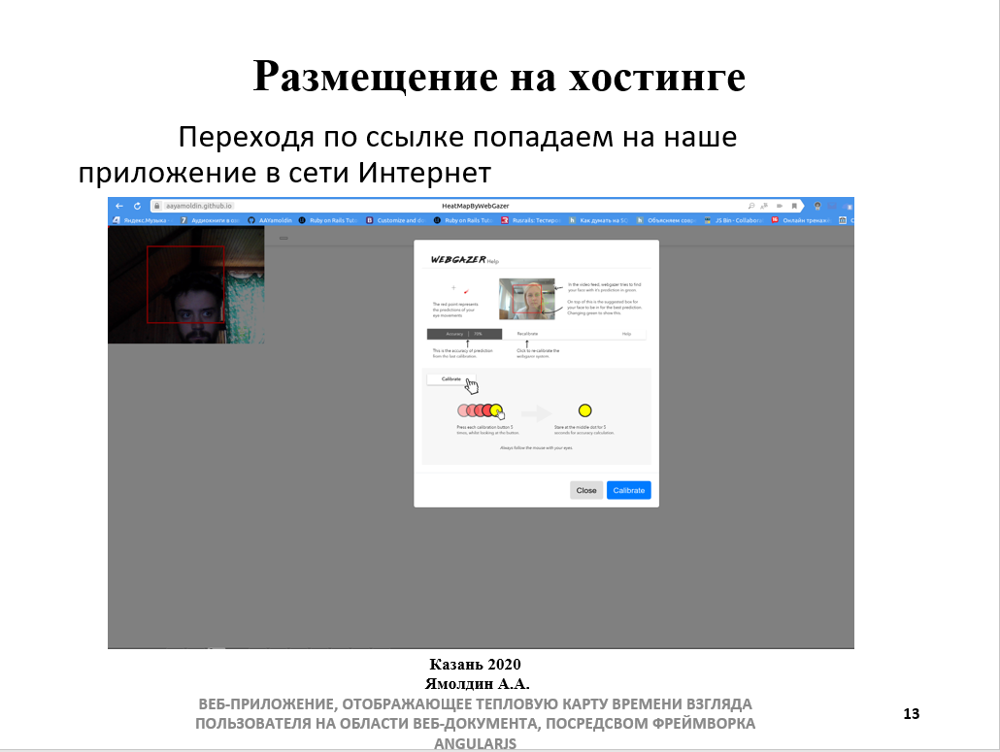
#### Слайд 14. Выводы
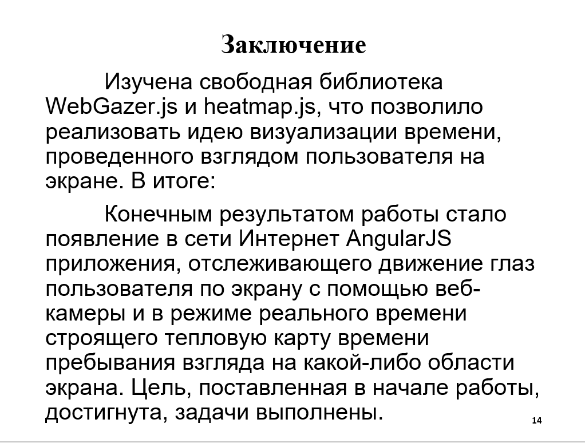


